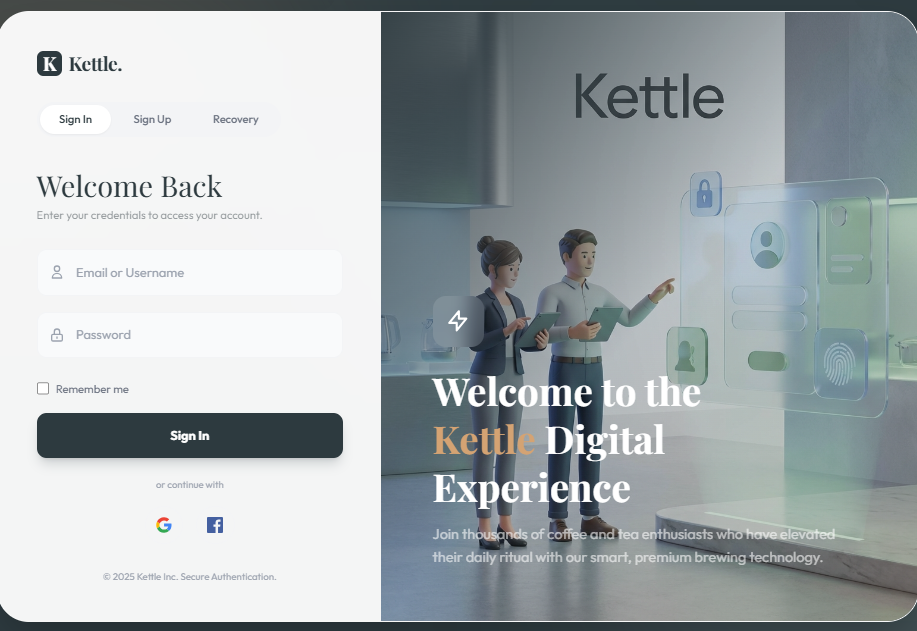
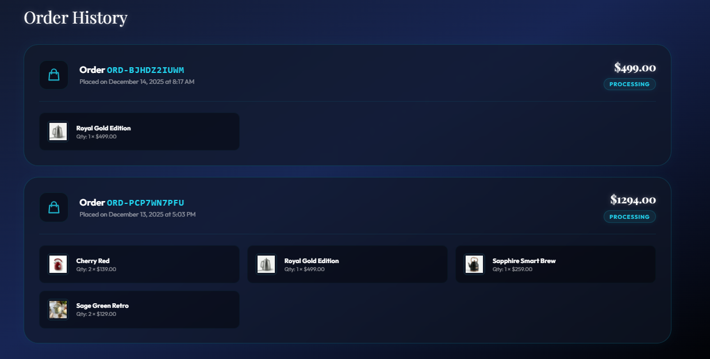
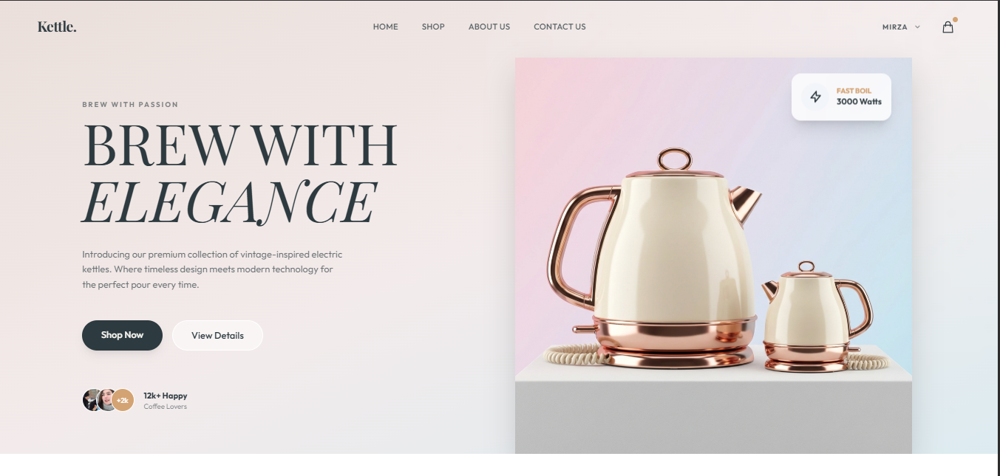

# Kettle - Premium E-Commerce Experience

Welcome to **Kettle**, a high-end e-commerce platform designed for elegance and performance. This project showcases a modern, full-stack shopping application built with **Laravel**, **Tailwind CSS**, and **Livewire**.

## 📸 Project Gallery

### Immersive Authentication
A distraction-free, glassmorphism-enhanced portal for seamless user access.


### Dashboard - Deep Dark Neon
Manage your orders in a premium dark environment with neon accents.


### Homepage Experience
From our Vintage Collection to the Member-Exclusive professional series.


## 🌟 Key Features

### 💎 Exclusive Member Collection
- **Member-Only Access**: Special "Limited Edition" products are visible only to logged-in users.
- **Infinite Slider**: A high-density, 5-column product slider with seamless infinite scrolling.
- **Professional Appliances**: A curated list of 25+ high-end kitchen items (Coffee Makers, Mixers, Grills) seeded into the database.

### 🎨 Dual-Theme Aesthetic
- **Light Theme**: The Homepage and Shop areas feature a clean, sophisticated "Brand Beige" and "Copper" aesthetic for clarity.
- **Deep Dark Neon Theme**:
    - **Checkout & Cart**: Transformed into an immersive **Deep Dark Blue/Black** environment with **Electric Cyan/Neon Blue** accents.
    - **My Profile & Orders**: Dashboard pages adhere to this premium dark mode.
    - **Footer & Info**: The bottom of the homepage ("About Us", "Contact Us", "Footer") features a special dark gradient "Zone" to match the checkout experience.

### 🛒 Dynamic Shopping Cart & Checkout
- **Instant AJAX Updates**: Add, remove, and update item quantities without page reloads.
- **Direct Purchase Flow**: "Add to Cart" takes you straight to the checkout for a frictionless experience.
- **Real-time Totals**: Optimistic UI updates ensure price totals change instantly as you adjust quantities.
- **Smart Validation**: Checkout forms preserve input and display clear, inline errors.

### 🔐 Unified Auth Portal
- **Distraction-Free**: A dedicated login/register page with no header or footer, focusing entirely on the user.
- **Glassmorphism Design**: Beautiful mesh gradients and smoked glass cards.
- **Client-Side Switching**: Switch between "Sign In" and "Sign Up" tabs instantly.

## 🛠️ Technology Stack
- **Framework**: [Laravel 10+](https://laravel.com)
- **Styling**: [Tailwind CSS](https://tailwindcss.com) (Custom config with Brand Colors)
- **Interactivity**: [Alpine.js](https://alpinejs.dev) & [Livewire](https://livewire.laravel.com)
- **Database**: SQLite / MySQL

## 🚀 Step-by-Step Installation

Follow these steps to set up the project locally:

### 1. Clone the Repository
```bash
git clone https://github.com/your-username/kettle-ecommerce.git
cd kettle-ecommerce
```

### 2. Install Dependencies
```bash
composer install
npm install
```

### 3. Environment Setup
Copy the example environment file and configure it:
```bash
cp .env.example .env
php artisan key:generate
```
*Make sure your database configuration in `.env` is correct.*

### 4. Database Setup & Seeding
Run migrations and seed the database with our **Exclusive Products** and **Vendor** data:
```bash
php artisan migrate --seed
```
*This command runs all seeders, including `MoreKitchenAppliancesSeeder`, to populate the store with 25+ items.*

### 5. Build Assets
Compile the Tailwind CSS and JavaScript assets:
```bash
npm run build
```

### 6. Run the Server
Start the local development server:
```bash
php artisan serve
```

Visit `http://127.0.0.1:8000` in your browser.

## 👤 User Accounts

The seeding process creates a default vendor account (optional) and you can register a new user to see the **Member Exclusive** features.

- **Register**: Go to `/login` and switch to the "Sign Up" tab to create your own account.
- **Log In**: Access your **Profile** and **Orders** from the top-right dropdown menu.

---

## 📂 Project Structure Highlights

- `resources/views/welcome.blade.php` - The main landing page with the Dual-Theme layout.
- `app/Http/Controllers/CartController.php` - Handles AJAX cart operations.
- `database/seeders/MoreKitchenAppliancesSeeder.php` - Populates the "Pro Kitchen Series" appliances.
- `resources/css/app.css` - Contains custom Tailwind animations and base styles.


## 💡 Usage Guide

### Shopping Flow
1.  **Browse**: Explore the homepage for our latest vintage kettles.
2.  **Member Exclusive**: Log in to unlock the "Limited Edition Collection" slider featuring professional kitchen gear.
3.  **Cart**: Use the top-right icon to modify your cart. Quantities update instantly.
4.  **Checkout**: A streamlined, verified checkout process designed for conversion.

### Admin & Vendor (Future Roadmap)
- Vendor dashboard for adding products.
- Analytics for sales and user growth.

## 🤝 Contributing
We welcome contributions! Please fork the repository and submit a Pull Request.

## 📄 License
This project is open-sourced software licensed under the [MIT license](https://opensource.org/licenses/MIT).

---
*Designed with Passion.*
